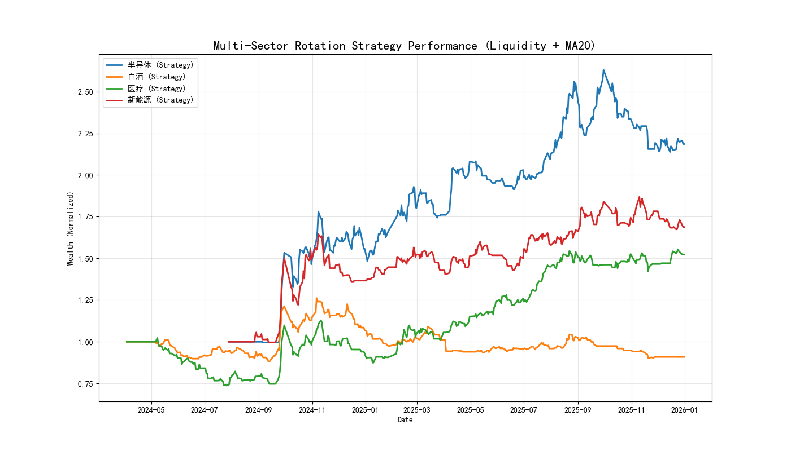

<div align="center">
  <a href="./README_zh.md">简体中文</a> | 
  <a href="./README.md">English</a>
</div>

<br />

# 📈 AShare-Macro-Rotation: Macro-Regime & Liquidity Driven Sector Rotation System


> **"Don't Fight the Fed."** — A full-stack quantitative trading framework for the A-Share market, combining Top-Down Macro Liquidity analysis with Bottom-Up Machine Learning timing.

## 📖 Introduction

**AShare-Macro-Rotation** is a multi-layered sector rotation and market timing system designed to navigate the volatile Chinese stock market. Unlike traditional single-factor strategies, this framework addresses the **"Regime Switching"** problem by integrating three distinct signal layers:

1.  **Macro Regime Identification**: Using **HMM (Hidden Markov Models)** to unsupervisedly cluster market states (Bull/Bear/Oscillation).
2.  **Liquidity Override Mechanism**: A "Constitution-level" rule based on the **Central Bank's Liquidity (M2-CPI Scissors)**. It forces a "Risk-On" mode during liquidity-driven bull markets, overriding technical signals.
3.  **Micro-Alpha Timing**: Deploying **LightGBM** for non-linear price prediction during oscillation markets.

Tested on key sectors (Semiconductor, New Energy, Healthcare, Liquor) from **2020 to 2026** (Out-of-Sample), the strategy demonstrates exceptional **Tail Risk Avoidance** during crashes and strong **Beta Capture** during liquidity floods.

---

## 📊 Performance Highlights

**Backtest Period**: 2020.01 - 2026.01 (Out-of-Sample)
*Includes the 2022 Bear Market, the 2024 Crash, and the 2025 Liquidity Bull Run.*



| Sector | Strategy Return | Benchmark Return | **Alpha** | Key Feature |
| :--- | :---: | :---: | :---: | :--- |
| **💊 Healthcare (CXO)** | **+52.33%** | +27.81% | **+24.52%** | 📉 **Crash Avoidance**: Stayed cash (0 position) during the 2021-2023 crash. |
| **⚡ New Energy (PV)** | **+68.83%** | +51.93% | **+16.90%** | 🚀 **Trend Following**: Captured high-beta growth in liquidity surges. |
| **💻 Semiconductor** | **+118.60%** | +110.30% | **+8.29%** | 🌊 **Liquidity Resonance**: Successfully identified the V-shape recovery. |
| **🍷 Liquor (Consumer)** | -9.08% | -9.29% | +0.20% | 🛡️ **Control Group**: Low sensitivity to liquidity factors (Earnings-driven). |

---

## 🧠 Methodology: The Three-Layer Signal Funnel

This strategy filters trading decisions through a hierarchical logic structure:

### Layer 1: Macro Regime Identification (HMM)
We utilize `GaussianHMM` to model the hidden states of the market based on macro and market data.


* **State 0 (Panic/Bear)**: High Volatility + Downward Trend $\rightarrow$ **Force Sell / Empty Position**.
* **State 1 (Oscillation)**: Low Volatility + Range Bound $\rightarrow$ **Activate Micro Timing (Layer 3)**.
* **State 2 (Bull/Rally)**: Steady Uptrend $\rightarrow$ **Hold / Buy**.
* *Features*: $LogReturn$, $Volatility_{20d}$, $LiquidityDiff$ (M2 YoY - CPI YoY).

### Layer 2: Liquidity Override (The "Fed" Rule)
This is the highest priority rule. When macro liquidity is overflowing, technical indicators often fail (e.g., RSI staying overbought).
$$Signal_{Override} = (M2_{YoY} - CPI_{YoY} > 5.0\%) \land (Price > MA_{20})$$
* **Logic**: If the M2-CPI scissors gap $> 5.0$ and the price is above the 20-day Moving Average, the market is defined as a **"Liquidity-Driven Bull."** The system forces a **Full Position (100%)**, ignoring HMM or LightGBM sell signals.

### Layer 3: Micro Machine Learning Timing (LightGBM)
Active only during **State 1 (Oscillation)** without Liquidity Override.
* Uses **LightGBM** (Gradient Boosting Decision Tree) to predict next-day direction.
* *Feature Engineering*: RSI, MACD, Volume-Price Divergence, Macro Interaction Terms (`Macro_RSI_Interact`).
* *Risk Control*: Position is taken only if the predicted probability $> 0.52$.

---

## 🛠️ Tech Stack & Engineering

* **Data Pipeline (ETL)**: `AKShare` (API for EastMoney/Sina) $\rightarrow$ `Pandas` Cleaning $\rightarrow$ CSV Persistence.
* **Modeling**:
    * `hmmlearn`: Unsupervised learning for regime detection.
    * `lightgbm`: Supervised learning for short-term alpha.
    * `scikit-learn`: Metrics (AUC, Accuracy) and Walk-forward validation.
* **Backtesting**: Vectorized Backtesting framework (No event loop for speed).
* **Infrastructure**: Dockerized environment for reproducibility.

---

## 📂 File Structure

```text
AShare-Macro-Rotation/
├── data/
│   ├── raw/                 # Raw CSVs (Macro data & Sector Indices)
│   ├── processed/           # Cleaned Feature Matrix
│   └── plots/               # Backtest Result Charts (.png)
├── models/
│   ├── hmm_regime.py        # HMM Model Training & State Visualization
│   └── lgbm/
│       └── lgbm_predict.py  # LightGBM Prediction Logic
├── strategy/
│   ├── final_composite_backtest.py # Core Strategy Logic (Override + HMM + LGBM)
│   ├── batch_run.py         # Batch Backtest Engine for All Sectors
│   └── sector_strategy.py   # Prototype Single-Factor Strategy
├── data_loader.py           # Data Fetching Script (AKShare)
├── data_processor.py        # Data Cleaning & Feature Engineering Script
├── Dockerfile               # Container Configuration
└── requirements.txt         # Python Dependencies

```

---

## 🚀 Quick Start

### 1. Prerequisites

Ensure you have Python 3.8+ or Docker installed.

```bash
git clone [https://github.com/YourUsername/AShare-Macro-Rotation.git](https://github.com/YourUsername/AShare-Macro-Rotation.git)
cd AShare-Macro-Rotation
pip install -r requirements.txt

```

### 2. Data Ingestion (ETL)

Fetch the latest Macro data (CPI/M2) and Sector Indices from AKShare:

```bash
python data/data_loader.py
# Output: 🎉 All sector data updated!

```

### 3. Data Processing

Align monthly macro data with daily price data to create the feature matrix:

```bash
python data/data_processor.py

```

### 4. Train Macro Model

Train the HMM to identify current market regimes:

```bash
python models/hmm_regime.py
# Generates hmm_signals.csv and regime plots.

```

### 5. Run Full Sector Rotation Backtest

Execute the batch strategy engine to compare performance across sectors:

```bash
python strategy/batch_run.py

```

*Result*: Check `data/plots/batch_sector_comparison.png` for the cumulative wealth curves.

---

## 📈 Case Studies

### Case A: The Crash of 2024 (Risk Off)

* **Market Context**: The HS300 Index plummeted due to economic slowdown.
* **Strategy Behavior**:
* Price fell below .
* HMM identified **State 0 (Panic)**.


* **Outcome**: The strategy maintained a **0% Position (Cash)**, creating a flat equity curve and avoiding significant drawdown.

### Case B: The Bull Run of 2025 (Risk On)

* **Market Context**: Central bank stimulus caused M2-CPI gap to widen to 8.4%. Market staged a V-shape recovery.
* **Strategy Behavior**:
* Triggered **Layer 2 Liquidity Override**.
* Despite technical indicators showing "Overbought," the strategy forced a **100% Position**.


* **Outcome**: Captured the full Beta of the rally, outperforming the "wait-and-see" approach.

---

## 📝 To-Do List

* [ ] Connect to live trading APIs (QMT/XtQuant).
* [ ] Integrate more macro factors (Social Financing, US Treasury Yields).
* [ ] Deploy to cloud server with Crontab for daily signal generation.

## 🤝 Contribution

This project is for research and educational purposes. Issues and PRs are welcome!

**Author**: [Hongran WANG]

---

*Disclaimer: Financial trading involves significant risk. This codebase is provided "as is" without warranty of any kind. Past performance is not indicative of future results.*

```

```
