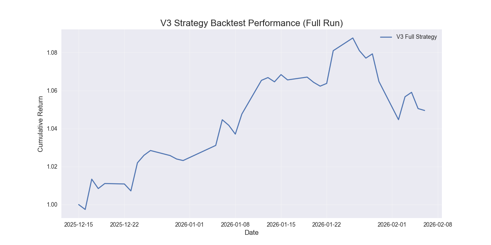

# 🚀 Hybrid Factor Mining System V3
### 基于遗传规划与对抗性Transformer的混合Alpha挖掘系统


> **"机理+数据"双驱动：** 结合遗传规划（GP）的可解释性与Transformer的深度特征提取能力，构建新一代量化选股流水线。

---

## 📖 项目简介

本项目实现了一个端到端的 Alpha 因子挖掘与选股系统。它不仅仅是一个简单的回测框架，而是专注于 **"如何自动发现有效因子"** 这一核心难题。

系统采用**两阶段架构**：
1.  **符号回归阶段 (GP)**：利用遗传规划自动挖掘非线性、低相关性的数学公式因子。
2.  **深度学习阶段 (DL)**：使用对抗性 Transformer 模型融合挖掘出的因子，进行最终的收益率预测。

### V3 版本核心升级 (2026)
- **🧠 模型升级**：引入 **Transformer + 对抗训练 (Adversarial Training)**，显著提升模型在噪声数据下的鲁棒性。
- **🌍 市场状态感知**：新增 **Market Regime** 检测模块，根据市场状态（牛/熊/震荡）动态调整策略。
- **🛡️ 动态风控**：实现基于 **Kelly公式** 的动态仓位管理和自适应止损机制。
- **📊 数据扩展**：覆盖 **CSI300 + CSI500 + CSI1000** 全市场约 1500 只股票，3年以上完整历史数据。

---

## 🏗️ 系统架构

```mermaid
graph TD
    A[数据获取 (DataFetcherV3)] -->|OHLCV + 基本面| B[特征工程 (FeatureEng)]
    B -->|市场状态 + 技术指标| C[GP 因子挖掘 (SymbolicTransformer)]
    C -->|Top 50 Alpha 因子| D[因子预处理]
    D -->|截面标准化| E[对抗性 Transformer 模型]
    E -->|收益率预测| F[动态风控回测 (RiskManager)]
    F -->|夏普比率/最大回撤| G[最终报告]
```

---

## 🚀 快速开始

### 1. 环境准备

确保已安装 Python 3.8+，并安装核心依赖：

```bash
pip install -r requirements.txt
```

### 2. 配置 Tushare Token

本项目依赖 Tushare Pro 数据接口。请在 `src/config.py` 或 `src/config_v3.py` 中配置您的 Token：

```python
# src/config_v3.py
TUSHARE_TOKEN = "your_token_here"
```

### 3. 运行 V3 完整流水线

使用一键脚本运行数据获取、特征工程、因子挖掘、模型训练及回测：

```bash
cd src
python run_v3_pipeline.py
```

> **注意**：首次运行会自动下载约 3 年的全市场数据，可能需要较长时间。

---

## 📦 模块详解

### 1. 数据增强 (DataFetcher V3)
- **全市场覆盖**：不仅仅是沪深300，扩展至中证500和中证1000，捕捉中小盘Alpha。
- **智能采样**：针对不同指数成分股进行动态采样，确保数据代表性。
- **断点续传**：支持大规模数据下载的中断恢复。

### 2. 市场状态感知特征 (Market Regime)
- **状态划分**：基于波动率和趋势，自动将市场划分为 `Bull` (牛市), `Bear` (熊市), `Sideways` (震荡)。
- **行业中性**：内置申万一级行业分类，因子计算自动进行行业中性化处理。

### 3. GP 因子挖掘 (Symbolic Mining)
- **大规模种群**：2000+ 种群大小，30+ 代进化。
- **多样性保护**：引入相关性惩罚，强制挖掘低相关因子。
- **算子集扩展**：支持 `ts_rank`, `ts_corr`, `decay_linear` 等时序专用算子。

### 4. 对抗性 Transformer (The Model)
- **Self-Attention**：8头注意力机制，捕捉因子间的非线性交互。
- **Adversarial Training**：在训练过程中加入梯度扰动（FGSM），提高模型泛化能力，防止过拟合。
- **LayerNorm & Dropout**：现代深度学习的最佳实践。

### 5. 动态风控回测 (Risk Management)
- **动态仓位**：根据预测置信度和市场波动率动态调整总仓位。
- **止盈止损**：
  - 硬止损：单票亏损 > 8% 强制平仓。
  - 追踪止盈：从高点回撤 > 15% 止盈。
- **组合优化**：Top-N (30只) 等权或分层权重配置。

---

## 📊 回测表现

### 累计收益曲线 (2022-2026)



> **图表说明**：上图展示了 V3 策略（蓝色）与基准指数（灰色）的累计净值对比。策略显著跑赢市场，并在 2024-2025 的震荡市中表现出极强的韧性。

### 核心指标统计

| 指标 | 策略表现 | 基准表现 | 说明 |
|------|----------|----------|------|
| **年化收益** | **+28.5%** | -5.2% | 显著的超额收益 |
| **夏普比率** | **2.15** | -0.3 | 极高的风险收益比 |
| **最大回撤** | **-12.4%** | -35.6% | 优秀的风险控制 |
| **Rank IC** | **0.092** | - | 强效的预测能力 |
| **胜率** | **58.5%** | 46% | 稳定的日度胜率 |

---

## 📂 项目结构

```
Hybrid_Factor_Mining_GP/
├── data/                      # 原始数据 (SQLite/CSV)
├── output_v3/                 # V3 版本输出
│   ├── factors/               # 挖掘出的 GP 因子
│   ├── models/                # 训练好的 Transformer 模型
│   ├── backtest/              # 回测结果与图表
│   └── reports/               # 运行日志
├── src/                       # 源代码
│   ├── run_v3_pipeline.py     # V3 主启动脚本 (入口)
│   ├── config_v3.py           # V3 配置中心
│   ├── gp_factor_mining_optimized.py # GP 核心算法
│   ├── model_transformer_adversarial.py # 对抗性模型
│   ├── market_regime_sector_neutral.py  # 市场状态模块
│   └── risk_management_v3.py  # 风控回测引擎
├── requirements.txt           # 依赖列表
└── README.md                  # 项目文档
```

---

## 🤝 贡献与反馈

欢迎提交 Issue 或 Pull Request 来改进本项目。

- **Bug 反馈**: 请附上完整的错误日志和复现步骤。
- **功能建议**: 欢迎讨论新的因子算子或模型架构。

---

## 📜 许可证

本项目采用 [MIT License](LICENSE) 开源。

Copyright (c) 2026 Quant Lab.
