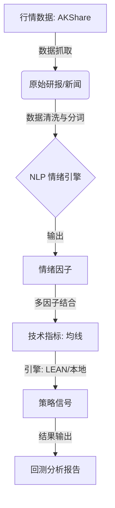
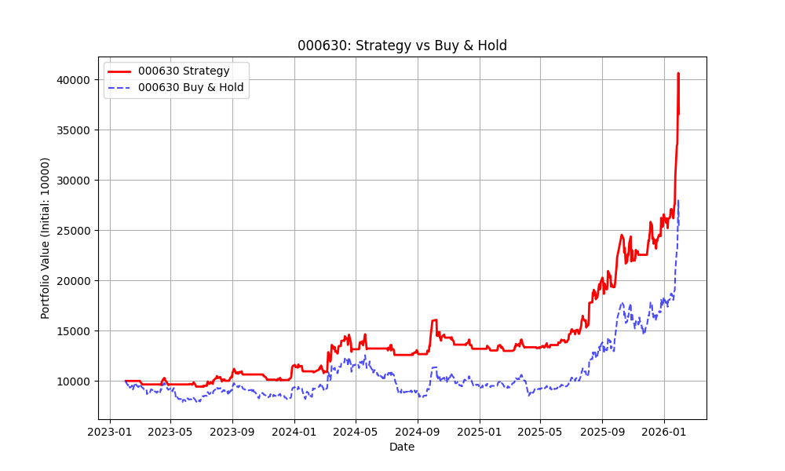
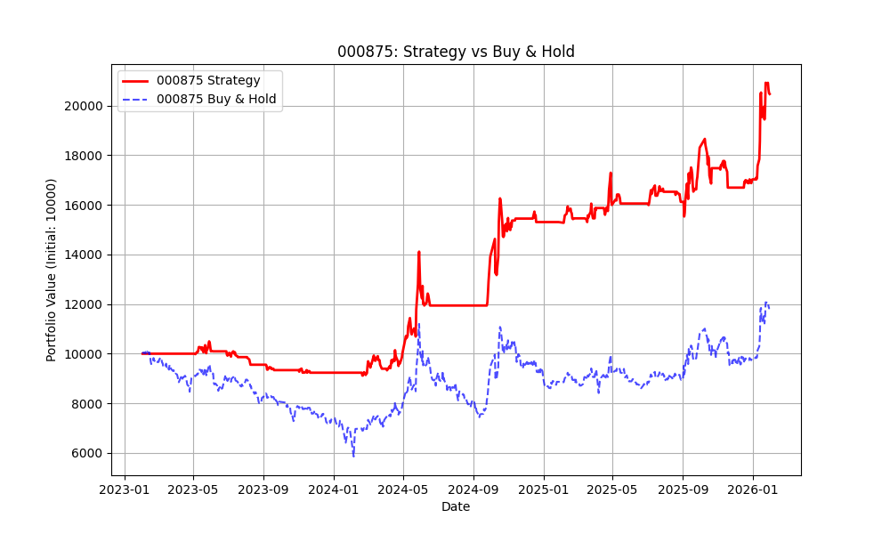
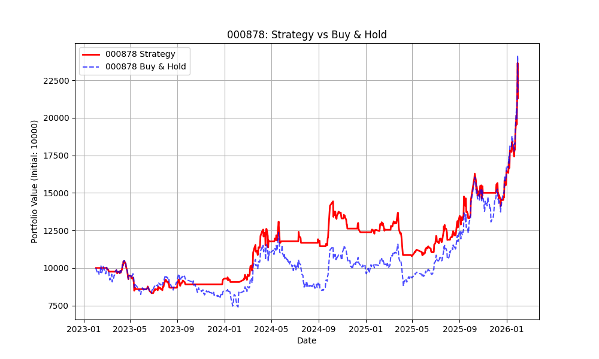
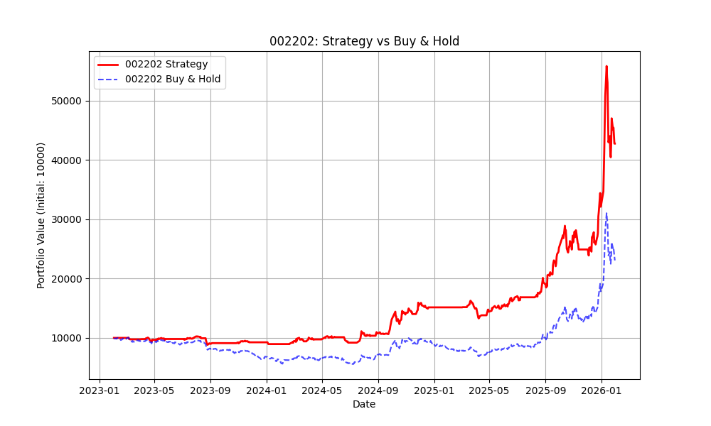
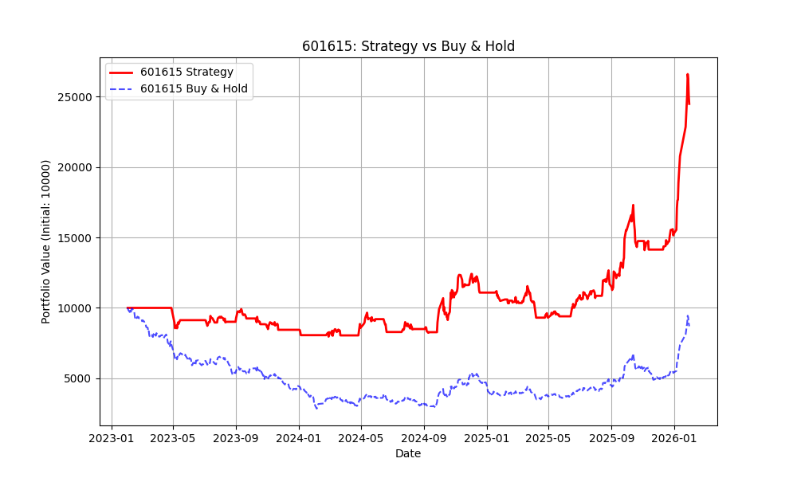

# 🚀 NLP 增强型多因子量化策略

[English Version](./README_EN.md)

本项目是一个高性能的**量化交易系统**，旨在填补非结构化金融文本与系统化交易之间的鸿沟。通过利用**自然语言处理 (NLP)** 技术，系统从券商研报中量化市场情绪并构建强大的 Alpha 因子，结合技术面趋势跟踪实现稳健的策略执行。

*图 1：金风科技 (002202) 净值曲线，展示了策略捕获 Alpha 超额收益的能力。*

---

## 🏗️ 1. 技术架构

系统采用模块化的 ETL 和策略执行流水线，确保了高度的数据完整性和策略灵活性。



---

## 🧠 2. 核心策略逻辑

### 2.1 情绪量化

* **Alpha 因子**: 将研报摘要转化为数值评分 $S_t$。
* **上下文分析**: 使用专门的金融情感词典识别高置信度的机构关键词（如：*“超预期”*、*“强推”*）。
* **信号衰减**: 引入线性衰减模型，以反映信息随时间推移对市场影响力的减弱：

$$ S_{effective} = S_{initial} \times e^{-\lambda t} $$

其中 $\lambda$ 为日度衰减率（默认设为 0.1）。

### 2.2 因子组合

| 因子类型 | 核心指标 | 作用 |
| --- | --- | --- |
| **Alpha** | NLP 情绪评分 | 决定入场/出场信心的主要信号 |
| **Beta** | 均线系统 (5/20) | 趋势确认与择时过滤 |
| **风险** | 动态回撤限制 | 基于波动率的仓位管理 |

---

## 📊 3. 回测表现展示

该策略在不同行业标的上展现出稳定的 Alpha 获利能力。以下是 6 个代表性标的的净值曲线：

| **000630 - 铜陵有色** | **000875 - 吉电股份** | **000878 - 云南铜业** |
| :---: | :---: | :---: |
|  |  |  |
| **002202 - 金风科技** | **601615 - 明阳智能** | **603067 - 振华股份** |
|  |  |  |

> **注意**：蓝线代表策略净值，红线代表基准（买入持有）。

---

## 📂 4. 项目结构

```text
├── data/                    # 行情与替代数据存储
│   ├── equity/daily/        # 股票日线价格数据 (OHLCV)
│   └── alternative/         # 经过 NLP 处理的情绪数据集
├── etl/                     # 数据抽取、转换与加载
│   ├── download_reports.py  # 基于 AKShare 的数据获取脚本
│   └── calc_report_sentiment.py # 情绪评分逻辑引擎
├── SentimentAlphaStrategy/  # 生产级策略文件
│   └── main.py              # LEAN 引擎执行核心逻辑
├── run_strategy_local.py    # 轻量化本地回测引擎
└── backtest_results/        # 可视化报告与日志输出

```

---

## ⚡ 5. 快速上手

### 环境准备

```bash
pip install pandas akshare matplotlib

```

### 执行流程

1. **同步数据**: `python etl/download_reports.py`
2. **生成因子**: `python etl/calc_report_sentiment.py`
3. **启动回测**: `python run_strategy_local.py`

---

## 🗺️ 6. 路线图与未来工作

* [ ] **LLM 升级**: 从基于词典的评分转向 **FinBERT** 或 **GPT-4** 架构，实现更深层的语义洞察。
* [ ] **多源舆情集成**: 引入社交媒体（雪球、股吧）情绪作为反向指标。
* [ ] **实盘接口对接**: 集成 **QMT/Ptrade** 接口实现自动化实盘交易执行。
* [ ] **进阶风险平价**: 开发基于实时因子波动率的动态仓位配比算法。

---

> **免责声明**: *本项目仅用于教学与研究目的。量化交易具有高度风险，历史表现不代表未来收益，入市需谨慎。*
