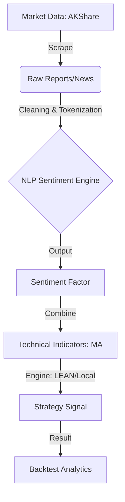

# 🚀 NLP-Enhanced Multi-Factor Strategy

[中文](./README.md)

This project is a high-performance **Quantitative Trading System** that bridges the gap between unstructured financial text and systematic trading. By leveraging **Natural Language Processing (NLP)**, it quantifies market sentiment from research reports to create a powerful Alpha factor, combined with technical trend-following for robust execution.

*Figure 1: Equity curve of Goldwind Science (002202), demonstrating the strategy's ability to capture alpha.*

---

## 🏗️ 1. Technical Architecture

The system follows a modular ETL and strategy execution pipeline, ensuring high data integrity and strategy flexibility.



---

## 🧠 2. Core Strategy Logic

### 2.1 Sentiment Quantification

* **Alpha Factor**: Converts research report summaries into a score .
* **Contextual Analysis**: Uses a specialized financial dictionary to identify high-conviction institutional keywords (e.g., *“Exceeds Expectations”*, *“Strong Buy”*).
* **Signal Decay**: Implements a linear decay model to reflect the diminishing impact of information over time:


where  is the daily decay rate (default 0.1).

### 2.2 Factor Combination

| Factor Type | Indicator | Role |
| --- | --- | --- |
| **Alpha** | NLP Sentiment Score | Primary signal for entry/exit conviction |
| **Beta** | Moving Averages (5/20) | Trend confirmation and timing filter |
| **Risk** | Dynamic Drawdown Limit | Position sizing based on volatility |

---

## 📊 3. Performance Gallery

The strategy shows consistent alpha generation across various sectors. Below are the equity curves for the 6 representative tickers:

| **000630 - Tongling Nonferrous** | **000875 - Jilin Electric** | **000878 - Yunnan Copper** |
| :---: | :---: | :---: |
|  |  |  |
| **002202 - Goldwind Science** | **601615 - Mingyang Smart** | **603067 - Zhenhua** |
|  |  |  |

> **Note**: Blue line represents the Strategy Equity, Red line represents the Benchmark (Buy & Hold).
---
## 📂 4. Project Structure

```text
├── data/                    # Storage for market and alternative data
│   ├── equity/daily/        # OHLCV market price data
│   └── alternative/         # NLP-processed sentiment datasets
├── etl/                     # Extraction, Transformation, and Loading
│   ├── download_reports.py  # AKShare data acquisition
│   └── calc_report_sentiment.py # Sentiment scoring engine
├── SentimentAlphaStrategy/  # Production-ready strategy files
│   └── main.py              # Main execution logic for LEAN
├── run_strategy_local.py    # Lightweight local backtest engine
└── backtest_results/        # Visual reports and logs

```

---

## ⚡ 5. Quick Start

### Prerequisites

```bash
pip install pandas akshare matplotlib

```

### Execution Pipeline

1. **Sync Data**: `python etl/download_reports.py`
2. **Generate Factors**: `python etl/calc_report_sentiment.py`
3. **Run Backtest**: `python run_strategy_local.py`

---

## 🗺️ 6. Roadmap & Future Work

* [ ] **LLM Upgrade**: Transition from dictionary-based scoring to **FinBERT** or **GPT-4** for deeper semantic insight.
* [ ] **Multi-Source Integration**: Adding social media sentiment (Xueqiu/Guba) as a contrarian indicator.
* [ ] **Real-time API**: Integrating with **QMT/Ptrade** for automated live trading execution.
* [ ] **Advanced Risk Parity**: Dynamic position sizing based on real-time factor volatility.

---

> **Disclaimer**: *This project is for educational and research purposes only. Quantitative trading involves significant risk. Past performance is not indicative of future results.*

---

